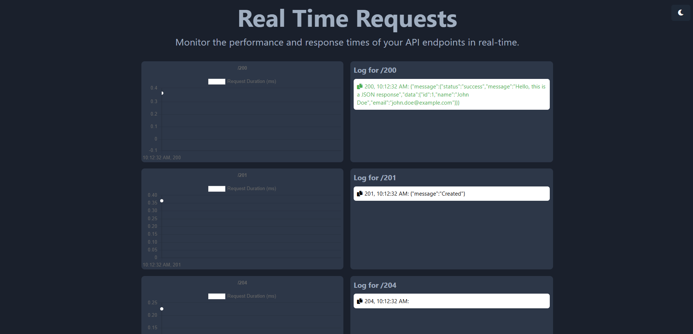

# Traffic Logger for Express

Traffic Logger is a simple way to monitor all the request traffic of your Express application. It logs the request time for each route used, giving you insights into the performance of your application.

## Next Steps

- [ ] Make everything more customizable
- [ ] Implement tests
- [ ] Organize the project
- [ ] Option to download the information

## Installation

To use Traffic Logger in your project, follow these steps:

1. Install the required package:
    ```sh
    npm install traffic-logger
    ```

2. Set up your Express application with Traffic Logger:
    ```javascript
    import express from "express";
    import { setupTrafficRouter } from "traffic-logger";

    const app = express();
    const port = 3000;

    const { router, server } = setupTrafficRouter(app, port);

    app.use(router);

    server.listen(port, () => {
      console.log(`Server is running on http://localhost:${port}`);
    });
    ```

## Usage

Once you have set up Traffic Logger, it will start logging request times for each route. You can access the traffic logs by navigating to `/traffic` on your server. For example, if your server is running on `http://localhost:3000`, you can view the traffic logs at `http://localhost:3000/traffic`.



## Features

- **Request Time Logging**: See the time taken for each request to be processed.
- **Route Performance**: Monitor the performance of different routes in your application.
- **Simple Setup**: Easy to integrate with your existing Express application.

## License

This project is licensed under the MIT License. See the [LICENSE](LICENSE) file for details.

## Contributions

Contributions are welcome, (This is my first package)! Please open an issue or submit a pull request for any improvements or bug fixes.

